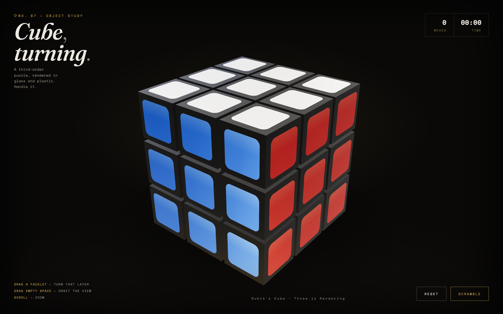

# Cube, turning.

An interactive 3×3×3 Rubik's Cube built with [Three.js](https://threejs.org/) — a single self-contained `index.html`, no build step, no dependencies to install.

**Play it live: [helmutqualtinger.github.io/Rubik](https://helmutqualtinger.github.io/Rubik/)**

## Run it

Open the [live version](https://helmutqualtinger.github.io/Rubik/), or open `index.html` locally in a modern browser. That's it — Three.js and its addons load from a CDN via an import map, so there's nothing to install or build.

## Controls

| Action | Effect |
|---|---|
| Drag a facelet | Rotates that layer live with your cursor — release past 45° to complete the turn, or short of it to snap back |
| Drag empty space | Orbits the camera around the cube |
| Scroll | Zooms in/out |
| **Scramble** button | Randomly mixes the cube |
| **Solve** button | Animates every move you've made back out, in reverse, until the cube is solved |
| **Reset** button | Instantly returns to a solved cube and clears history |
| **Sound** toggle | Mutes/unmutes the turn clicks and solve chime |

The HUD tracks your move count and a timer (starts on your first turn), and shows a "Solved." banner the moment every face matches — orientation-agnostic, so it works correctly no matter how the cube has been scrambled or rotated in view. Every turn plays a short mechanical click and solving plays a small rising chime — both synthesized live with the Web Audio API, no sound files involved.

## How it works

- **27 independent cubies** sit on an integer grid; each tracks its own logical `(x, y, z)` position separately from its Three.js transform.
- **Face turns** are done by reparenting the affected layer's cubies onto a temporary pivot group, then either animating the pivot a fixed ±90° (scramble/solve) or driving its rotation live from your cursor every frame (manual drags) — either way, the result gets baked back into each cubie's position and grid coordinate on completion.
- **Solve** doesn't run a cube-solving algorithm — it replays every recorded move (scramble included) in reverse with the direction flipped, an exact undo stack, so it always lands on solved regardless of how the cube got scrambled.
- **Turn detection**: a grabbed face can only spin about the two axes lying in its own plane — 2 candidates. The instant your drag clears a small pixel threshold, each candidate's predicted on-screen motion (from a small positive rotation) is compared against your actual drag direction, and whichever matches best is locked in as the turning axis. From then on, that same axis's screen-space direction is used every frame to convert your live drag distance into a rotation angle — that's what makes the layer follow your cursor in real time rather than snapping instantly — calibrated by camera distance and zoom rather than any specific point on the cube, so it feels consistent everywhere you grab.
- **Materials** are brushed metal: `MeshPhysicalMaterial` with high metalness, an anisotropic highlight, and a procedurally generated brush-grain bump map, lit by a soft top/bottom `RectAreaLight` rig plus a procedural studio environment map for reflections.
- **Sound** is synthesized, not sampled: each click is a short bandpassed noise burst plus a low sine "thock," and the solve chime is a four-note triangle-wave arpeggio — all built from `AudioContext` nodes on the fly.

See [`CLAUDE.md`](CLAUDE.md) for a fuller architecture breakdown if you're digging into the code.
